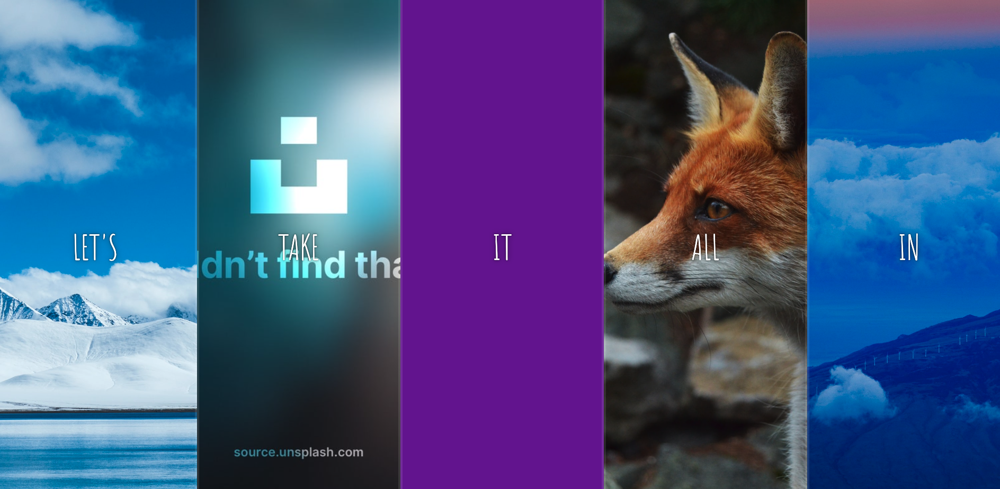
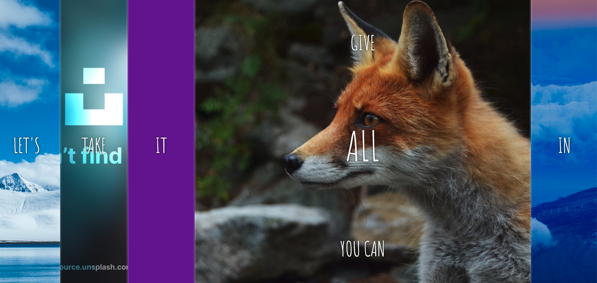

# Vanilla JavaScript Flex Panel

## The Odin Project Assignment - 30 Day JavaScript Challenge

### Challenge 3

Assignment : Create a static WebPage that is sensitive to mouse click and upon each click it will animete the strings within the Y axis and also enlarge the clicked item
so that it covers larger area on the screen real estate

What is learned:

Practiced TranslateY
Practiced Flex grow
Practiced JS dom manipulation

# Before

# On click

